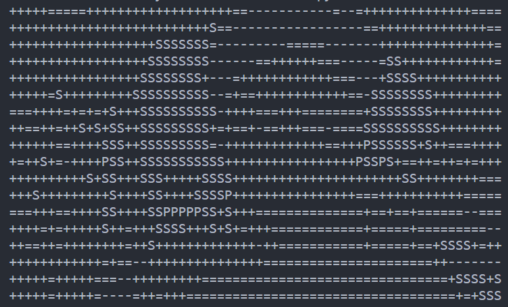

# ascii-art

## Description
>This Project will take an image and print out an [ASCII-art](https://en.wikipedia.org/wiki/ASCII_art).

## About this Project
>This project uses [opencv](https://www.opencv.org) to process image and [numpy](https://numpy.org) to manipulate arrays. The Image is numerically coded for different threshold regions it comes under and for each coded regions , a symbol is used for printing it out in the stdout.

## อธิบายง่ายๆ
> โปรเจคดังกล่าว ใช้ opencv(งานภาพ) เเละ numpy(งาน array) ซึ่งเป็นเครื่องมือสำเร็จรูปของ python เเล้วผมก็นำเครื่องมือ 2 ตัวนั้นมาใช้ในการสร้าง โปรเเกรมสำหรับสร้างศิลปะ ascii art (ตัวอักษรเรียงเป็นรูป)

#  วิธีใช้

## - ติดตั้ง เครื่องมือ
    pip install opencv-python
>
    pip install numpy

## - copy code

## - เตรียมรูปภาพ (ควรเป็นfile .png .jpg)
    รูปภาพต้องใส่ไว้ข้างๆ กัน

## - เข้าไปเเก้ใข code
    เเก้ file ให้ตรงกับภาพที่เรานำมาใส่

    line 10 :

    image_path = "spa.jpg" ##ชื่อรูปภาพ
    image_path = "เเก้ตรงนี้" ##ชื่อรูปภาพ

## - สิ่งที่สามารถเข้าไปเเก้ได้เพิ่มเติม

* `symbols_list`
* `threshold_list`

#   ตัวอย่าง

